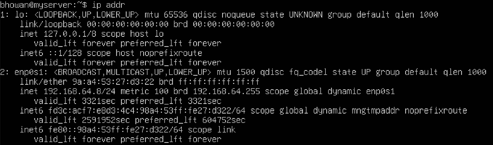
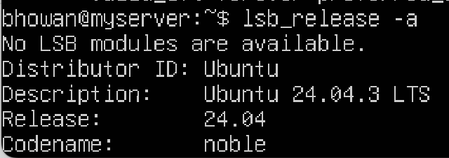

````markdown
# Week 1: System Planning and Distribution Selection

## 1. System Architecture
This project utilizes a dual-system architecture designed to simulate a professional remote administration environment. The infrastructure allows for complete isolation of the server environment while maintaining administrative access via SSH.

### Architecture Diagram
The following diagram illustrates the virtualization stack on the Apple Silicon host, detailing the network bridge and hardware passthrough layers.

```text
+------------------------------------------------------------------------------------------------------+
|                           PHYSICAL HOST: Apple MacBook Pro (Apple Silicon)                           |
|                                                                                                      |
|  macOS Host OS                                                                                       |
|  --------------------------------------------------------------------------------------------------  |
|  • Terminal/iTerm2 (SSH Client)                                                                      |
|  • Networking Stack: vmnet, pf firewall, routing table                                               |
|  • Virtual Bridge: bridge100  (IP: 192.168.64.1)                                                     |
|  • UTM Virtualization Engine:                                                                        |
|        - QEMU (aarch64) + Apple Hypervisor Framework                                                 |
|        - Virtio Devices (Net/Block/Balloon)                                                          |
|        - UEFI Firmware                                                                               |
|                                                                                                      |
|  Traffic Flow (SSH): macOS → bridge100 → vmnet NAT/bridge → VM.enp0s1 → sshd                         |
+---------------------------------------------|--------------------------------------------------------+
                                              |
                                              v
+------------------------------------------------------------------------------------------------------+
|                           GUEST VM: Ubuntu Server 24.04 LTS (ARM64)                                  |
|                                                                                                      |
|  Virtual Hardware:                                                                                   |
|     • vCPU (AArch64)                                                                                 |
|     • RAM (virtio-balloon)                                                                           |
|     • Disk: disk-0.qcow2 (virtio-blk)                                                                |
|     • Network: enp0s1 (virtio-net)                                                                   |
|            - IP: 192.168.64.8                                                                        |
|            - Gateway: 192.168.64.1                                                                   |
|                                                                                                      |
|  OS Services:                                                                                        |
|     • systemd                                                                                        |
|     • cloud-init (first boot)                                                                        |
|     • netplan (network config)                                                                       |
|     • OpenSSH Server (sshd :22)                                                                      |
|                                                                                                      |
|  VM Directory Structure (UTM .utm bundle):                                                           |
|     • config.plist                                                                                   |
|     • Data/                                                                                          |
|          ├── disk-0.qcow2                                                                            |
|          ├── nvram                                                                                   |
|          └── EFI vars                                                                                |
+------------------------------------------------------------------------------------------------------+
````

  * **Host:** MacBook Pro (Apple Silicon) - Workstation
  * **Hypervisor:** UTM (QEMU Virtualization)
  * **Guest:** Ubuntu Server 24.04 LTS (ARM64)
  * **Connection:** SSH over Shared Network (Port 22)

## 2\. Distribution Selection Justification

I have selected **Ubuntu Server 24.04 LTS (ARM64)** for the server component.

  * **Justification:** Ubuntu LTS provides 5 years of guaranteed security updates, making it an industry-standard choice for production environments. I specifically selected the **ARM64 (AArch64)** architecture to run natively on my Apple Silicon hardware. This avoids the significant performance overhead of x86 emulation.
  * **Comparison:** While **Debian** offers extreme stability, its packages are often older. **CentOS Stream** has shifted to an upstream development model, making it less predictable than Ubuntu LTS. Ubuntu strikes the best balance of stability, documentation availability, and modern package support.

## 3\. Workstation Configuration

I have selected **Option B: Host Machine** for the administrative workstation.

  * **Configuration:** I am using the native **macOS Terminal (ZSH)** on my host machine.
  * **Justification:** macOS is a UNIX-certified operating system. Its native terminal supports all required standard tools (`ssh`, `scp`, `ssh-keygen`) out of the box. Using the host machine reduces system resource overhead by not running a secondary GUI-based VM, allowing me to dedicate more RAM (3GB) to the server for intensive performance testing.

## 4\. Network Configuration

The network is configured using UTM's **Shared Network** mode (Emulated VLAN).

  * **Isolation:** This creates a private network segment (`192.168.64.0/24`) that is accessible only by the host machine, satisfying the "Host-Only" security isolation requirement.
  * **Connectivity:** It permits necessary outbound traffic (NAT) for the server to download package updates without exposing the server directly to the external local area network.


**Evidence of Network Configuration:**


## 5. System Specifications (CLI Evidence)
The following evidence demonstrates the successful deployment of the headless server and the establishment of remote administration capability.

**System Specs (Kernel, Memory, Disk):**

*Evidence of `uname -a`, `free -h`, and `df -h` commands running on ARM64 architecture.*

**IP Address Configuration:**

*Evidence of `ip addr` showing valid IP assignment.*

**Successful Remote SSH Connection:**

*Demonstration of successful remote login from macOS terminal to Ubuntu Server.*


```
```
