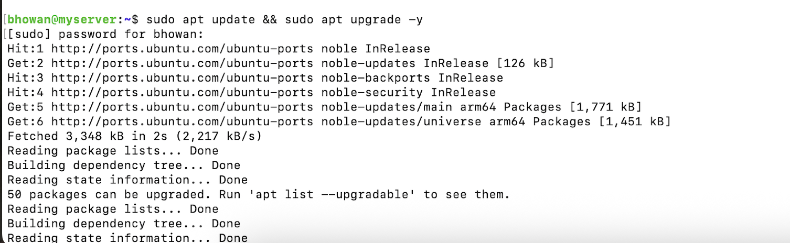
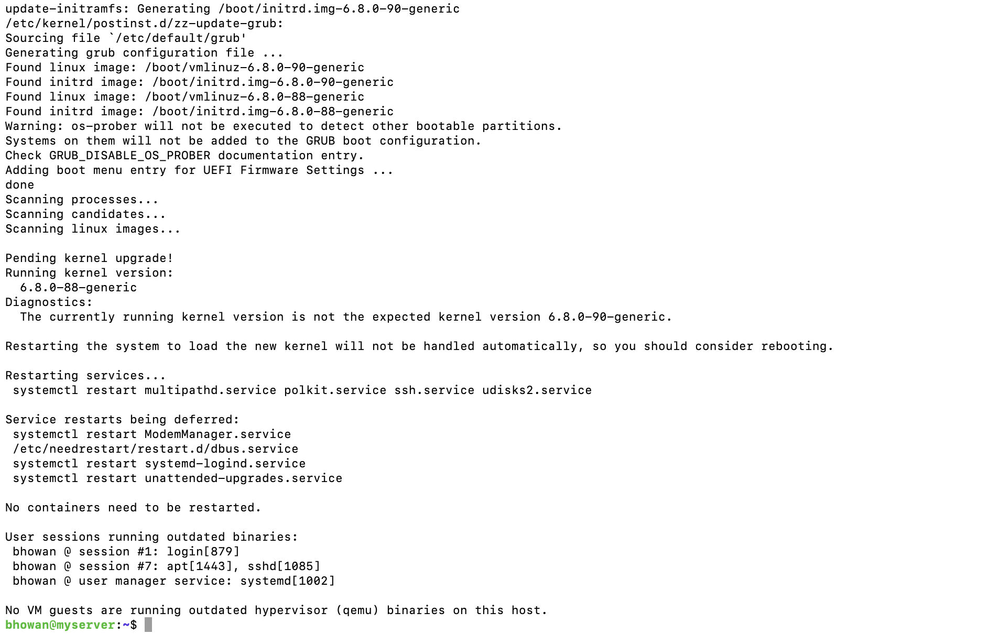
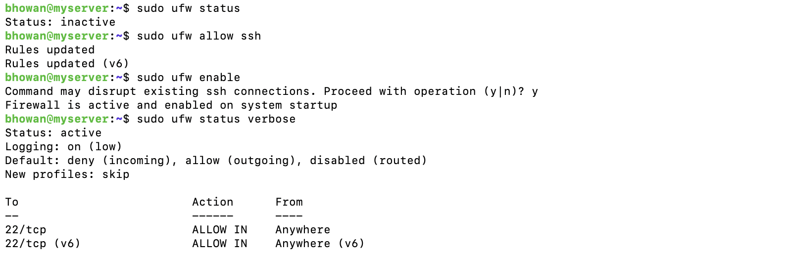

# Week 2: Security Planning and Hardening

## 1. Security Update Strategy
Maintaining an up-to-date system is the first line of defense against vulnerabilities. I have implemented a routine patching strategy using the `apt` package manager.

* **Action Taken:** I performed a full system update and upgrade to ensure all software packages and kernel security patches were applied immediately after installation.
* **Command Used:** `sudo apt update && sudo apt upgrade -y`

**Evidence of Patching:**

*(Upload your update screenshot and rename it to updates.png)*

## 2. Firewall Configuration (Perimeter Defense)
To secure the network perimeter, I enabled the **Uncomplicated Firewall (UFW)**. The strategy is to block all incoming traffic by default and allow only specific, necessary management ports.

* **Policy:** Deny Incoming (Default), Allow Outgoing.
* **Rules:** Allowed TCP Port 22 (SSH) to permit remote administration.
* **Status:** Active and verified.

**Evidence of Firewall Status:**

*(Upload your firewall screenshot and rename it to firewall.png)*

## 3. SSH Hardening (Access Control)
The default password-based authentication is vulnerable to brute-force attacks. I have transitioned the server to **Public Key Infrastructure (PKI)** authentication.

### 3.1 Key Generation and Installation
I generated an **Ed25519** key pair on the host workstation (MacBook) and installed the public key on the server. This cryptographic handshake is significantly more secure than standard passwords.

**Evidence of Key-Based Login:**

*(Screenshot showing successful login without a password prompt)*

### 3.2 Disabling Password Authentication
To fully secure the SSH service, I modified the server configuration to reject all password-based login attempts. This renders brute-force dictionary attacks ineffective, as the server will deny connection attempts that do not possess the private key.

* **Configuration Change:** Edited `/etc/ssh/sshd_config.d/50-cloud-init.conf` to set `PasswordAuthentication no`.
* **Verification:** Attempted a forced password login, which was successfully rejected by the server.

**Evidence of Secured Access:**

*(Upload your "Permission denied" screenshot and rename it to lockout.png)*
