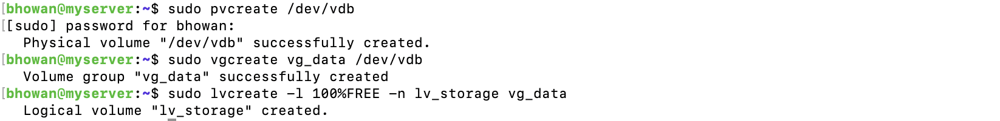
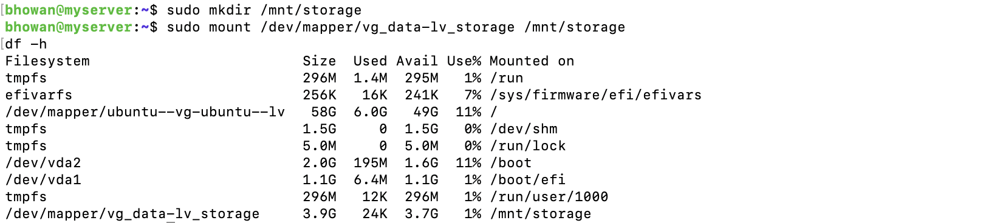

# Week 3: Storage Configuration and Performance Planning

## 1. Storage Configuration Log (LVM Implementation)

To introduce flexibility and dynamic storage management, a 4GiB secondary virtual disk was added to the Ubuntu server via UTM's hardware configuration.  This is the first piece of required evidence.

After booting, the new disk was verified in the command line using `lsblk` (visible as `/dev/vdb`). The Logical Volume Management (LVM) structure was then initiated:
1. The disk was initialised as a Physical Volume (`pvcreate /dev/vdb`).
2. The Volume Group (`vg_data`) was created, pooling the new storage space.
3. The Logical Volume (`lv_storage`) was created, utilising 100% of the available space within the Volume Group.

The verification of this structure, showing both the **Volume Group (vgs)** and **Logical Volume (lvs)**, is the second piece of evidence.

Finally, the Logical Volume was prepared for use by formatting it with the `ext4` filesystem (`mkfs.ext4`) and creating a dedicated mount point at `/mnt/storage`. The volume was mounted and verified using the `df -h` command. To ensure this new partition remained accessible after system reboots, the UUID of the Logical Volume was added to the `/etc/fstab` file for persistence. The final verification, which shows the new 3.9 GB partition successfully mounted at `/mnt/storage` after a system reboot, serves as conclusive evidence.

---

## 2. Application Selection Matrix (Deliverable 1)

This matrix selects applications representing distinct workload types for performance evaluation in Week 4.

| Workload Type | Application | Justification |
| :--- | :--- | :--- |
| **CPU-Intensive** | **`stress-ng`** | Applies configurable synthetic load across all cores to measure maximum CPU throughput and core stability. |
| **RAM-Intensive** | **`stress-ng`** | Configured to allocate and dirty large amounts of memory, testing memory controller and swap performance. |
| **I/O-Intensive** | **`fio` (Flexible I/O Tester)** | Industry-standard tool for generating custom block-level disk reads and writes, ideal for testing the new LVM partition (`/mnt/storage`). |
| **Network-Intensive** | **`iperf3`** | Dual-mode client/server tool used to generate and measure network bandwidth and latency between the Host and the Guest. |
| **Server Application** | **`NGINX`** | A lightweight but common web server used to simulate a production workload and measure stability and response time under modest load. |

---

## 3. Expected Resource Profiles (Deliverable 3)

Anticipated resource usage during the performance tests for proper analysis.

* **`stress-ng` (CPU):** Expected CPU utilization near **100%** on all allocated cores. RAM usage remains low.
* **`stress-ng` (RAM):** Expected RAM utilisation near **100%** (filling both physical memory and swap); CPU utilisation should be moderate (20-40%).
* **`fio` (I/O):** Expected Disk I/O (reads/writes) to be near maximum throughput on the LVM partition; CPU and RAM usage should be low/moderate.
* **`iperf3` (Network):** Expected minimal CPU or RAM usage, but high network interface utilisation; performance is dependent on the virtual network bridge speed.

---

## 4. Monitoring Strategy (Deliverable 4)

This explains the specific commands and approach used to measure performance remotely.

| Metric | Server Command | Host Command | Purpose |
| :--- | :--- | :--- | :--- |
| **CPU/RAM Load** | `top` / `free -h` | N/A | Real-time monitoring of CPU core usage and memory consumption on the server. |
| **Disk I/O** | `iostat` | N/A | Measures throughput (MB/s) and latency on the `/dev/mapper/vg_data-lv_storage` partition during `fio` tests. |
| **Network Latency**| N/A | `ping 192.168.64.8` | Captures Round-Trip Time (RTT) delay and packet loss from the host workstation during high-stress tests. |
| **Process State** | `ps aux` | N/A | Verifies that the test application (`stress-ng`, `fio`, etc.) is running correctly and consuming the expected resources. |
