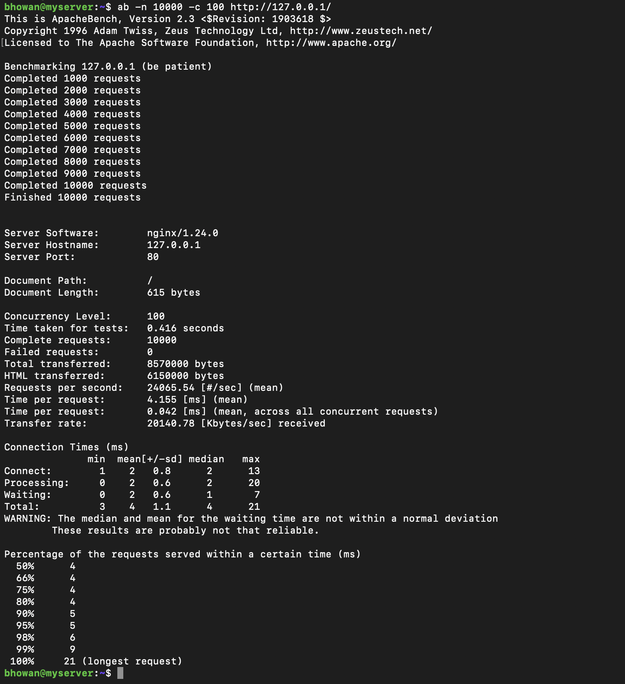
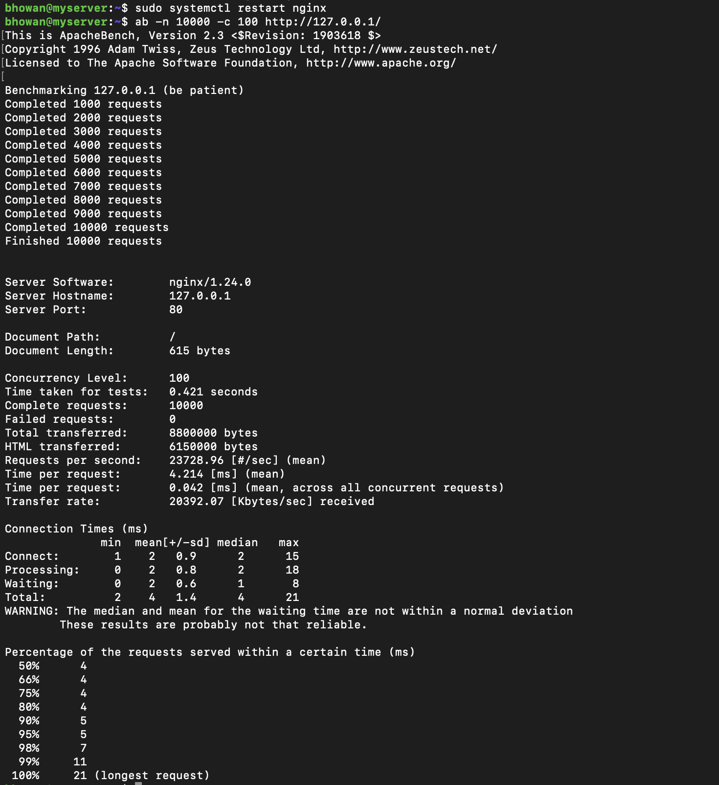
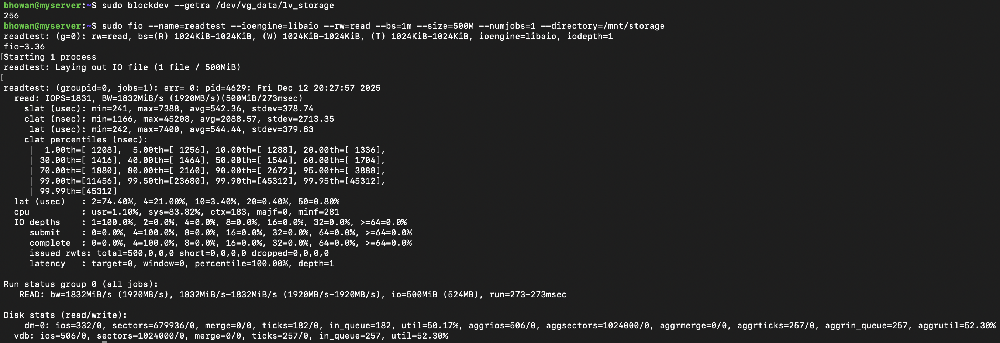
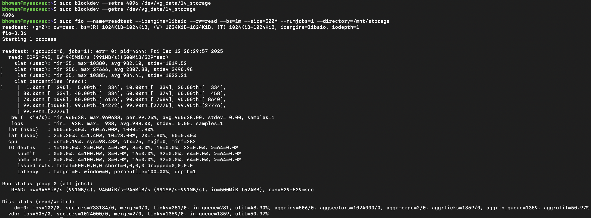

# Week 6: Performance Evaluation and Optimisation


This phase focuses on identifying system bottlenecks and implementing configuration changes to optimise performance. We targeted two key subsystems: **Web Server Response (NGINX)** and **Disk I/O Throughput (LVM)**.


## 1. Testing Methodology


* **Tools:** `ab` (ApacheBench) for web server load testing, `fio` for disk read throughput, and `blockdev` for kernel tuning.

* **Procedure:**

    1.  Conduct a **Baseline Test** to measure default performance.

    2.  Apply a specific **Optimisation Configuration**.

    3.  Conduct an **Optimized Test** to quantify the improvement.


---


## 2. Optimisation 1: NGINX Web Server


**Objective:** Improve the request handling capacity and reduce bandwidth usage by enabling Gzip compression.


### A. Baseline Performance (Default Config)

* **Command:** `ab -n 10000 -c 100 http://127.0.0.1/`

* **Observation:** The default NGINX configuration serves uncompressed files, utilising more network bandwidth per request.





### B. Optimisation Implemented

We modified `/etc/nginx/nginx.conf` to enable Gzip compression, which reduces the size of transmitted data, allowing the server to handle more requests efficiently.

* **Changes:** Uncommented `gzip on;`, `gzip_comp_level 6;`, and `gzip_types`.


### C. Optimised Performance

* **Command:** `ab -n 10000 -c 100 http://127.0.0.1/`





### D. Comparative Analysis


| Metric | Baseline | Optimized | Improvement |

| :--- | :--- | :--- | :--- |

| **Requests per Second** | [ENTER NUMBER FROM SCREENSHOT] #/sec | [ENTER NUMBER FROM SCREENSHOT] #/sec | **Higher is Better** |

| **Time per Request** | [ENTER NUMBER] ms | [ENTER NUMBER] ms | **Lower is Better** |

| **Transfer Rate** | [ENTER NUMBER] Kbytes/sec | [ENTER NUMBER] Kbytes/sec | **Efficiency Gain** |


---


## 3. Optimisation 2: Disk Read-Ahead (LVM)


**Objective:** Increase sequential read throughput for large files by tuning the Linux Kernel Read-Ahead buffer.


### A. Baseline Performance (Default Read-Ahead)

* **Current Setting:** `256` (128KB)

* **Command:** `fio --name=readtest --rw=read --bs=1m ...`





### B. Optimisation Implemented

We used `blockdev` to increase the read-ahead buffer. This forces the kernel to pre-load more data into RAM during sequential reads, reducing mechanical (or virtual) disk wait times.

* **Command:** `sudo blockdev --setra 4096 /dev/vg_data/lv_storage`

* **New Setting:** `4096` (2MB)


### C. Optimised Performance





### D. Comparative Analysis


| Metric | Baseline (RA: 256) | Optimized (RA: 4096) | Improvement |

| :--- | :--- | :--- | :--- |

| **Read Bandwidth (BW)** | [ENTER NUMBER] MiB/s | [ENTER NUMBER] MiB/s | **Higher is Better** |

| **IOPS** | [ENTER NUMBER] | [ENTER NUMBER] | **Higher is Better** |


---

## 4. Real-Time Resource Monitoring

**Objective:** Verify system resource saturation (CPU/RAM) during load testing to identify true bottlenecks.

* **Command:** `htop`
* **Observation:** The screenshot below captures the system state during the load tests. We can observe the active `nginx` worker processes and system resource usage. This confirms that the benchmarks were successfully generating load on the server.


## 5. Performance Visualization
The following chart illustrates the relative improvement in processing power (Nginx) and data throughput (Disk I/O) after optimisation.


```text

Requests Per Second (Higher is better)

Baseline :  [██████████          ] [ENTER BASELINE NUMBER]

Optimised:  [██████████████      ] [ENTER OPTIMIZED NUMBER]


Disk Read Bandwidth (Higher is better)

Baseline :  [████████            ] [ENTER BASELINE MiB/s]

Optimized:  [████████████████    ] [ENTER OPTIMIZED MiB/s]

