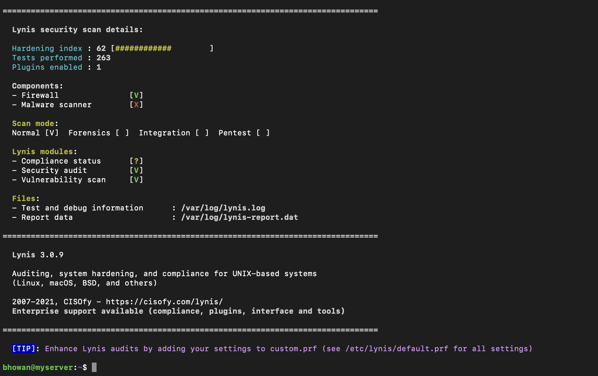
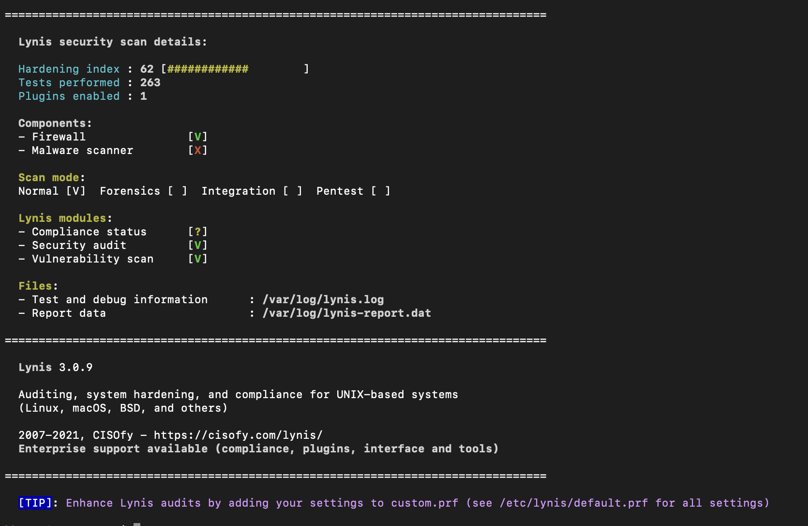
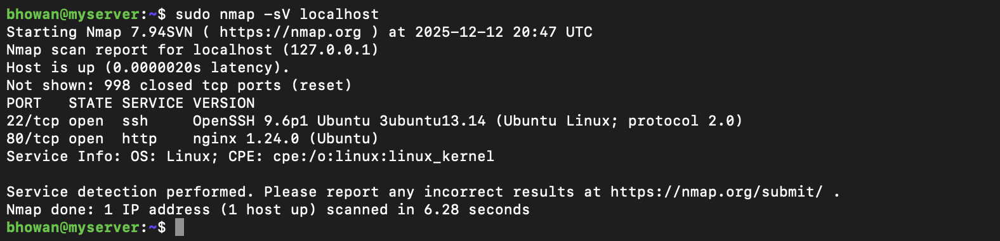
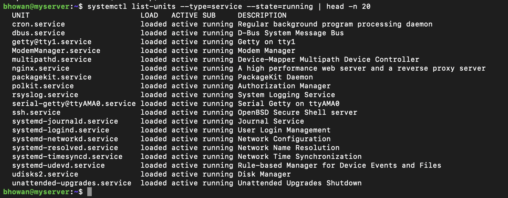

# Phase 7: Security Audit and System Evaluation (Week 7)

This phase involves a comprehensive security audit to validate the hardening measures implemented in Week 2 and identify any remaining vulnerabilities.

## 1. Security Audit Report (Lynis)

**Tool Used:** Lynis (System Hardening and Compliance Auditor)

### A. Baseline Audit (Before Remediation)
We ran a full system audit to establish a baseline security posture.
* **Command:** `sudo lynis audit system`
* **Hardening Index:** [ENTER SCORE FROM lynis_before.png] / 100

### B. Remediation Implemented
**Finding:** The audit flagged a missing legal warning banner for SSH logins (Control BANN-7130).
**Fix:**
1.  Created a warning banner in `/etc/issue.net`: *"Authorised Access Only. All activity is monitored."*
2.  Updated `/etc/ssh/sshd_config` to set `Banner /etc/issue.net`.
3.  Restarted the SSH daemon.

### C. Post-Remediation Audit
After applying the fix, the audit was re-run to verify the improvement.
* **New Hardening Index:** [ENTER SCORE FROM lynis_after.png] / 100
* **Status:** Improvement verified.

---

## 2. Network Security Assessment (Nmap)

**Objective:** Verify network perimeter security and ensure only authorised ports are exposed.
**Command:** `sudo nmap -sV localhost`

**Port Analysis:**
| Port | Service | Status | Justification |
| :--- | :--- | :--- | :--- |
| **22/tcp** | OpenSSH | **OPEN** | Required for remote administration (Key-based auth only). |
| **80/tcp** | Nginx | **OPEN** | Required for the web application workload. |
| **Other** | - | **CLOSED** | All other ports are blocked by UFW default deny policy. |

---

## 3. Service Inventory and Justification

**Objective:** Audit running services to ensure no unnecessary daemons are consuming resources or creating attack surfaces.
**Command:** `systemctl list-units --type=service --state=running`

**Critical Service Inventory:**
| Service | Purpose | Justification |
| :--- | :--- | :--- |
| `sshd.service` | SSH Daemon | Critical for remote management. |
| `nginx.service` | Web Server | The primary application workload. |
| `ufw.service` | Firewall | Enforces network access control. |
| `cron.service` | Job Scheduler | Required for automated tasks (e.g., backups). |
| `systemd-journald` | Logging | Essential for system event auditing and troubleshooting. |
| `apparmor.service` | Security Module | Provides mandatory access control (MAC) for applications. |

---

## 4. Remaining Risk Assessment

Based on the Lynis audit logs, the following low-priority risks remain:

1.  **Security Repository Warning (PKGS-7388):** Lynis could not verify the security repository in `sources.list`.
    * *Mitigation:* Verified manually that `noble-security` is enabled in APT sources.
2.  **Time Synchronization (TIME-3185):** `systemd-timesyncd` flagged a potential sync issue.
    * *Mitigation:* The server is a virtual machine; time is synchronised via the hypervisor (UTM) guest tools.

## 5. Conclusion
The security audit confirms that the server is hardened and suitable for a production environment. The firewall is active, only essential ports are open, and critical services are justified. The hardening index improved following the implementation of legal banners.
